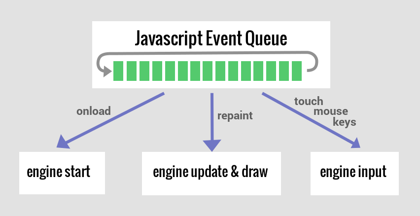
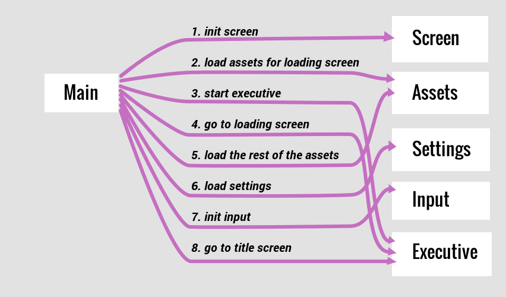
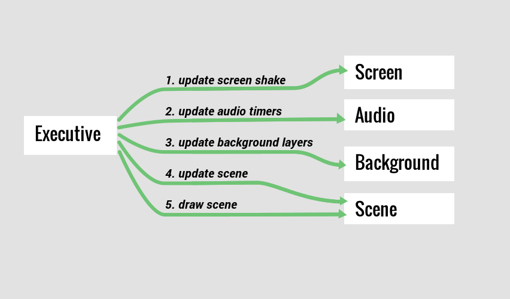

# Core Flow and Architecture

This is an overview of the core code used by the game and tools.

## Flow

The game engine is written in Javascript, so its architecture must operate
around javascript's [event
queue](http://javascript.info/tutorial/events-and-timing-depth).  The game is
started by the onload event, updated and drawn by the repaint event (through
requestAnimationFrame), and accepts control through the input events.

### Engine Start

The engine is started from the "main" module.

### Engine Update & Draw

The engine updates through the "executive" module.

## Architecture

This is a description of the core modules in the engine.

### Main

There is a "main" module for the game and each tool that coordinates modules
for initialization:

- initializes the screen
- starts the loading screen
- starts loading all assets
- triggers initialization events and starts executive when assets are loaded

### Screen

There is a screen module which controls:

- screen resolution
- camera offset and scale
- screen shaking
- 3D frustum
- conversion between our space and screen coordinates

### Assets

There is an assets module which contains:

- list of asset file paths and types
- logic for building game structures from assets
- logic for loading all assets at once

### Executive

There is an executive module that controls:

- the main loop
- variable update rate
- display of the computed framerate
- execution speed for slowmo and pausing

### Scenes

A scene is any object that can be plugged into the main loop as a unit of
execution.  It has the following functions:

- init (called when we switch to this scene)
- update (called every frame with the time elapsed since last frame)
- draw (called every frame with canvas context)
- cleanup (called when we switch to another scene)

### Input

There is an input module which provides:

- touch/mouse events in screen or space coordinates

### Settings

There is a settings module that provides:

- access to all scores/settings variables
- persistence of all scores/settings variables
