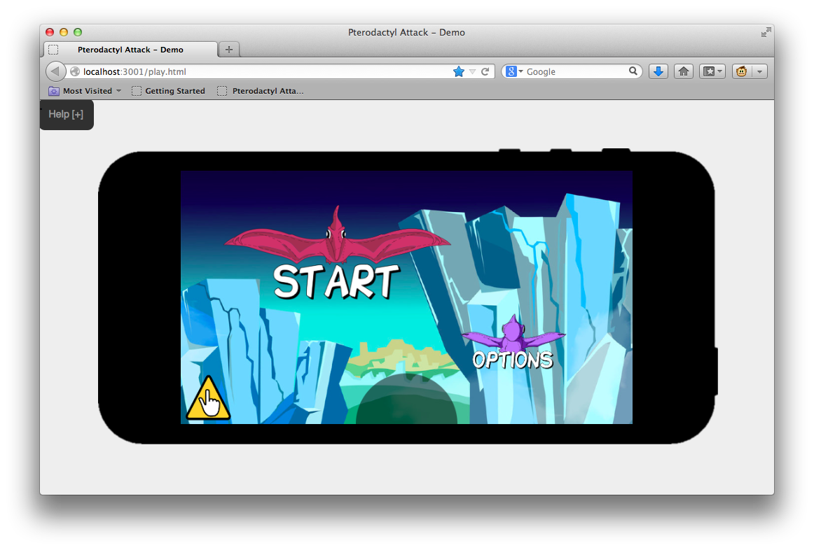
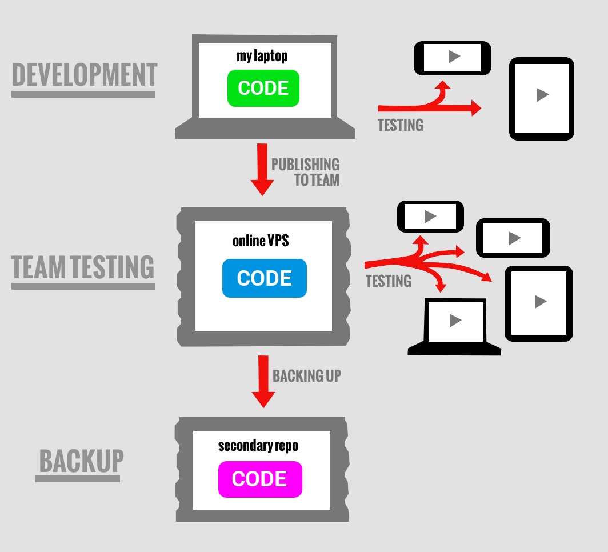
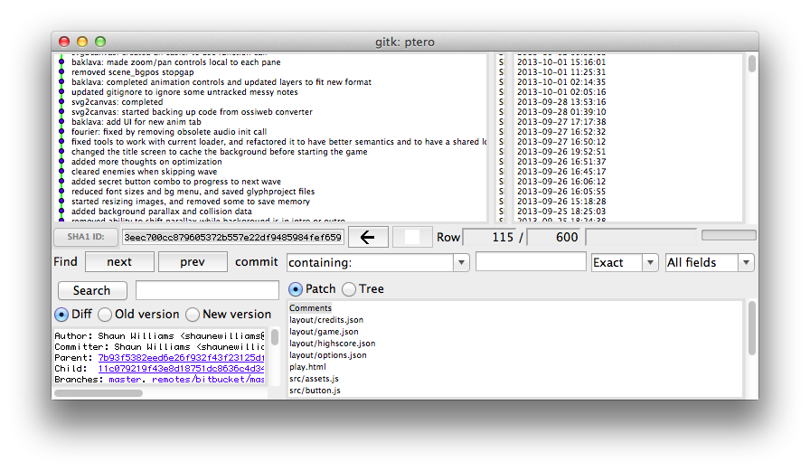

# Dev Ops

This section is an overview of our Developer Operations, a fancy term for the
structure that evolved to handle our day-to-day workflow.  Specifically, I'll
describe the processes in which I develop, test, publish, and backup the game.

## How the game runs

The game is built on HTML5 Canvas and Javascript, meaning we can simply play it
in the browser.

But the game is really intended as a mobile game for phones and tablets.  So we
primarily run it with the [CocoonJS Launcher for
iOS/Android](http://wiki.ludei.com/cocoonjs:launcherapp).  This is done by
giving the launcher a zip file containing all the webpage files for our game.

When we're ready to release the game, CocoonJS will take our zip file and turn
it into a native app that we can put on App Store or Google Play.

## Team Workflow

I am the sole programmer on the team.  Art assets are handed to me to integrate
into the game.  The game and its content-tools are accessible from any browser
for the team members to use, via a private web server.  For the most part, the
content generated by the tools are handed back to me to integrate into the
game.  Stable versions of the game are frequently pushed out to our private web
server so the team can test the game.

Here is diagram to simplify the general workflow:

Everything after this point will be pretty technical, so read on if you're
interested in details.

### Tracking Development

The game workspace consists of code, data, images, and notes.  I want to track the
history of all the changes in this workspace, and I want it backed up in
different places so that I won't lose all the work I've done.

To this end, I track all the work in a [git](http://git-scm.com/) repository.
It contains the entire history of the project so that I may revisit any past
version for any reason (e.g. undoing changes, searching for bugs).  It also
allows me to sync it to other locations for distributing and redundant backups.

This is a preview of the `gitk` command, a history visualizer:

Another benefit is that I can perform some analytics on my project history.
For example, I used [this setup](work/git-heatmap) to create this visualization
of the number of code commits I made each day:

### Programming Environment

There's nothing too fancy about my programming environment.  It is a directory
of files that I navigate in a Terminal and edit with a text editor,
VIM.

The game and the tools are HTML files that include their respective Javascript
files from the source directory.  I can just open "play.html" in the browser
and it would run fine.  But to run the tools, I am required to run a custom
webserver app so that the tools have access to write back to the workspace.  So
I run this custom Node application at the root directory with `node server.js`,
and navigate my browser to http://localhost:3001.  This pops up:

(The tools shown above will be covered in a later chapter)

The main page serves as a hub for me and the team, to provide links to the
game, tools, and other team-related items elsewhere on the web.

To test the game on my phone, I run a `build.py` script which auto-generates a
couple files, then creates the cocoon.zip file containing all the files needed
to run the game on mobile.  Since the webserver is running from this directory,
I just point the CocoonJS Launcher on my phone to the URL:
http://localhost:3001/cocoon.zip.

#### Debugging

Looking back, I am bewildered that I never used an actual debugger to place
breakpoints to check state or step through the code.  I may be forgetting a few
times that I had used it, but my usual process was to look at stack traces when
the game crashed and to use `console.log` and `console.error` functions to
print helpful messages.

My favorite browser console is in Chrome, plainly due to its larger console
buffer, easier message filtering, and auto-clearing on refresh.  The CocoonJS
Launcher has a good console for debugging on mobile as well.

CocoonJS Launcher has a Memory Log for viewing memory usage of textures.  I emailed
their support team for a similar log for Vector Path images, and they agreed it
would be useful, so it might come.

CocoonJS Launcher also allows you to [profile your
game](http://wiki.ludei.com/cocoonjs:launcherprofile), which confirmed to me
that true type fonts are still very slow, among other things.

### Publishing to Team

#### Syncing and Backing Up Changes

When I'm ready to publish a stable version to the team, I use the `git push`
command to essentially copy my current working version of the workspace to an
online private server ([a Linode VPS](https://www.linode.com/)).

With ssh access, I push my stable code to a
[bare](http://git-scm.com/book/ch4-2.html) repository that I setup on this
private server.  When my changes are received, it automatically executes a
custom script called the [post-receive
hook](http://git-scm.com/book/en/Customizing-Git-Git-Hooks).  I made this hook
try to sync the new changes to a non-bare repository, where its content is served
privately to the team.

I have a separate bare and non-bare repository to keep any potential unsyced
changes in the non-bare repository (from the tools content) from blocking the
update thereby completely disrupting the backup process.

The aforementioned hook also pushes the received changes to a private
[bitbucket](https://bitbucket.org) repository as an automated backup process.

#### Webserver setup

On the webserver, I use the [forever](https://npmjs.org/package/forever) tool
to run the Node server app I mentioned previously.  I do this so that the
app restarts if my VPS itself restarts.

On top of that, I run an [nginx](http://wiki.nginx.org/) webserver on the VPS
to appropriately direct traffic to the Node server using proxy-pass. I further
configure it with password protection so that only team members may access it.

