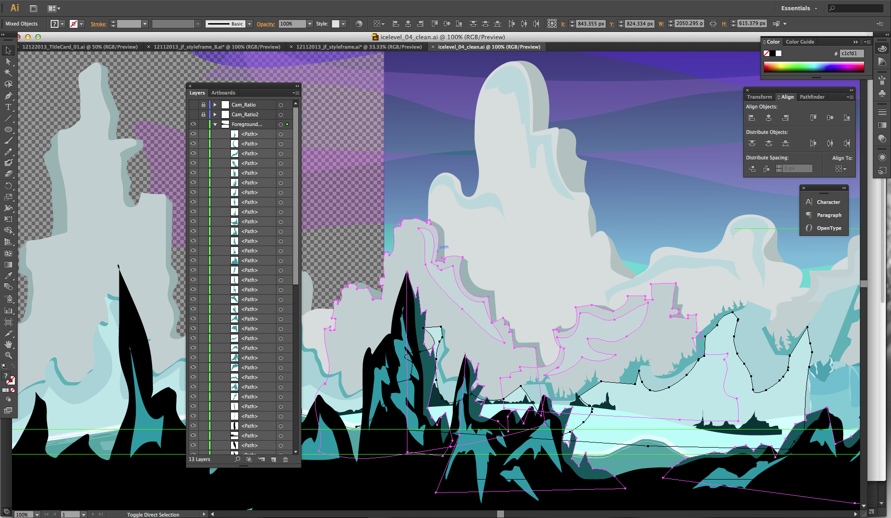

# Environment Backgrounds

At the time of this writing, the game has three different environments:
mountain, ice, and volcano.

## Layers

Each environment in the game consists of multiple layers of vector images that
support linear animated movement, collision detection, and parallax motion from
phone rotation.

### Composition

Environments are composed of layers as seen below.

### Depths

Each layer is placed at different depths.  Each highlighted layer below is
shown in red and its position is shown in two perspectives of the viewing
frustum in red also.

### Animations

Each environment has an entrance/exit animation that is displayed when entering
or leaving a level.

You may have noticed that some layers are wider than others.  This is to allow
some layers to move wider distances for the animation.  You can see the
animation here: <http://youtu.be/eTPD1DZ-7fU>

### Collision

The volcano environment has some obstacles that the player should not be able
to shoot through.  Thus, this environment has simple collision polygons
for blocking your bullets:

Mathematically, when a bullet crosses a layer's plane, it is blocked if its
point of intersection is contained in any of the collision polygons for that
layer.

### Parallax

When tilting the phone, the layers close to the screen move slightly to create
a parallax effect, illustrated below.

## Workflow

### Conversion

As we discussed in a previous article, there is a long conversion process that
our background assets must go through before they can be displayed in our
engine.

First, our artist draws all the layers in Adobe Illustrator (see below) and
exports an SVG file to send to me.

Next, I run it through an automated background converter that splits all the
top-level groups of the SVG file into separate layers.  Each SVG layer is dumped
to a given directory, as well as converted to a Canvas Path image.

Finally, the new background is primed and ready for customization.

### Customization

I created a tool for customizing each of our environment's layer depth,
animation, collision, and parallax properties.  I called it Baklava,
after the pie that has many layers.

View this video for a demonstration of the tool.
