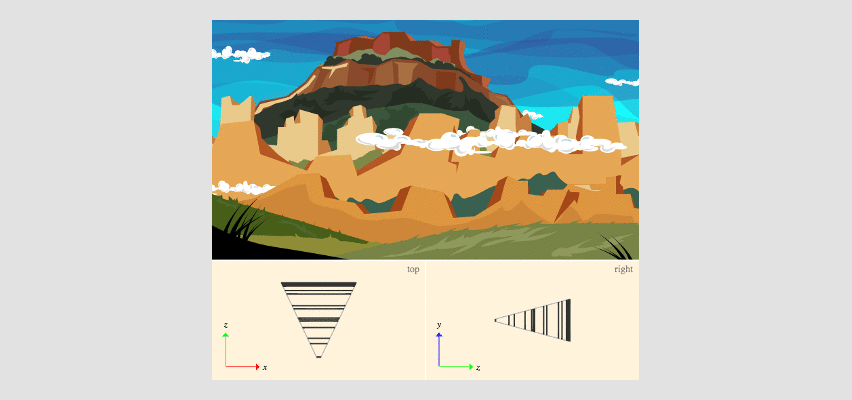
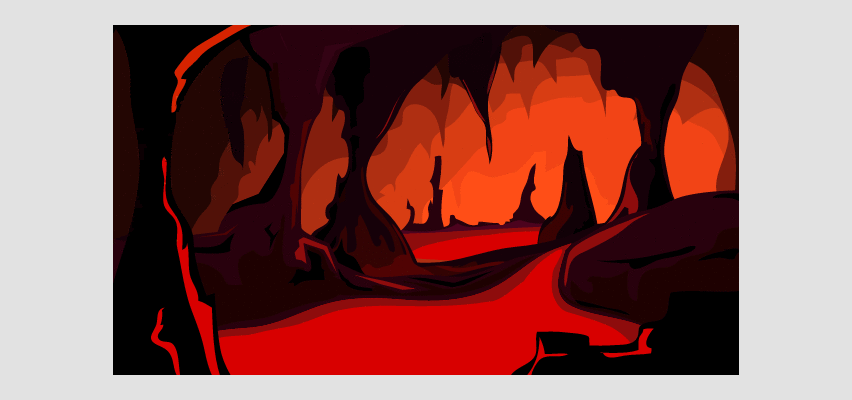

# Environment Backgrounds

The environments in our game consist of layered vector images that support
linear animated movement, collision detection, and parallax motion from phone
rotation.

## Layers

### Composition

At the time of this writing, we have three different environments: mountain,
ice, and volcano.  You can see the layer composition of each below.

### Depths

Each layer is placed at different depths, as you can see below.  Each
highlighted layer below is shown in red and its position is shown in two
perspectives of the viewing frustum in red also.

### Animations

Each environment has an entrance/exit animation that is displayed when entering
or leaving a level.

You may have noticed that some layers are wider than others.  This is to allow
some layers to move wider distances for the animation.  You can see the
animation here: <http://youtu.be/eTPD1DZ-7fU>

### Collision

The volcano environment has some obstacles that the player should not be able
to shoot through.  To this end, this environment has simple collision polygons
for blocking your bullets:

When a bullet crosses a layer's plane, it is blocked if its point of
intersection is contained in any of the collision polygons for that layer.

### Parallax

When tilting the phone, the layers close to the screen move slightly to create
a parallax effect to reinforce a perception of depth in the game.

## Workflow

### Conversion

As we discussed in a previous article, there is a long conversion process that
our background assets must go through before they can be drawn by our engine.

Our artist draws all the layers in Adobe Illustrator and exports an SVG file to
send to me.  I then run it through an automated background converter that
splits all the top-level groups of the SVG file into the engine's supported
formats for each layer.

### Customization

After our new environment background is converted, we can start creating its
layer depth, animation, collision, and parallax.  This is done from a tool I
created called Baklava.  I chose that name because baklava has a lot of layers
and is alliteratively similar to background.

View this video for a demonstration of the tool.
