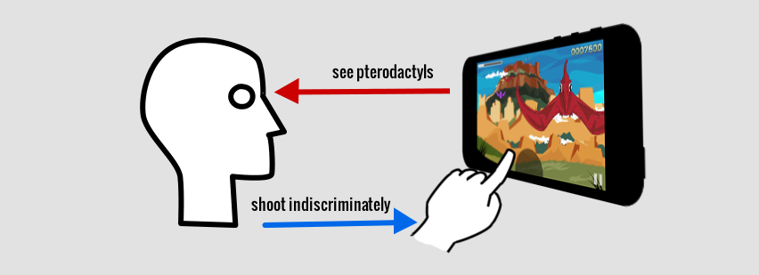
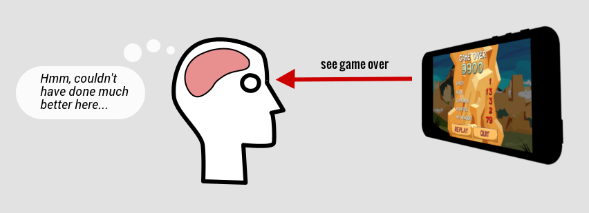
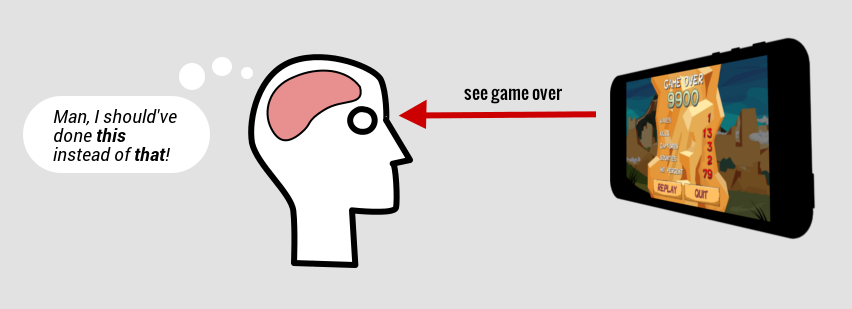
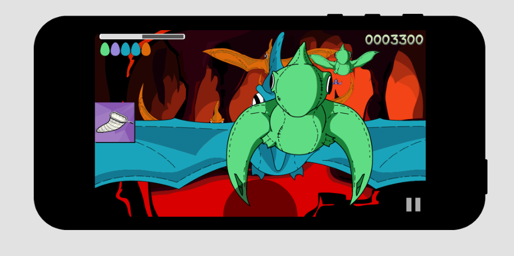

# Gameplay Design

What follows is an explanation of how we tried to build a fun game around a
simple firing mechanic.

## Starting with simple shooting

The game started with just a single mechanic of firing bullets.  The accuracy
and speed of your bullets was the only determing factor for how well you were
doing in the game.  Frankly, this mechanic didn't have any excitement.  It was
interesting in and of itself, but it made for very stale gameplay.

## What was missing

I realized that in this simple game, if the player dies, it was only because
they weren't shooting fast enough.  I don't think that's a compelling enough
reason to continue playing.

I postulated that at the end of a game, the player has to feel a sense that
they could've done something better.  Instead of mindlessly shooting as fast as
they could, there had to be some kind of decision to make-- something to make
them think and reason about what they were doing.  In other words, there has to
be an element of strategy that the player will want to improve in their
play-throughs.

## The capture mechanic

The capture mechanic was introduced to create these aforementioned "decision
moments" in the game.  The player is presented with different colored eggs
as part of a bounty for earning health.  You capture the correct colors
to earn a point of health to help you survive more waves.

Capturing takes only one shot, so it's easier than shooting an enemy down.  But
if you capture an incorrect color, the "cage" of pterodactyls captured for the
current bounty is emptied, creating a potentially difficult situation to
recover from.

The context switching between strategic capturing and frantic shooting created
a much more interesting experience that encourages the player to choose when to
be calm and when to be frantic.  It's a decision strategy that enriched an
otherwise dull experience.

## Points

(Talk about how to earn points)

## Attack Patterns

(Talk about attack intervals)

## Adjusting the difficulty

Designing a good difficulty curve is rather difficult.  The problem of
balancing accessibility and pacing is probably best addressed by creating
separate difficulty levels.  This may be something I continue experimenting
with, but I settled on having an initially difficult game to encourage you to
get better.  It seems to be designed well for someone with responsive motor
skills who can connect their thoughts to their actions in the game.

Super Hexagon comes to mind when trying to justify the initial difficulty.  But
Hexagon is a very well designed game whose elements are certainly missing for
Pterodactyl Attack.

## Changes in scenery

The game changes scenery after every wave.  The effect serves the pacing of the
game well in the beginning, creating a perception of progress early on.  Though
this effect is lost in the later stages, I believe the saturation of level
rotations is quelled by the difficulty and resulting desire for a breath of air
between waves.
