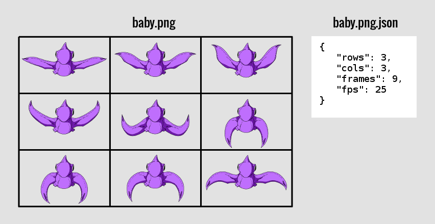
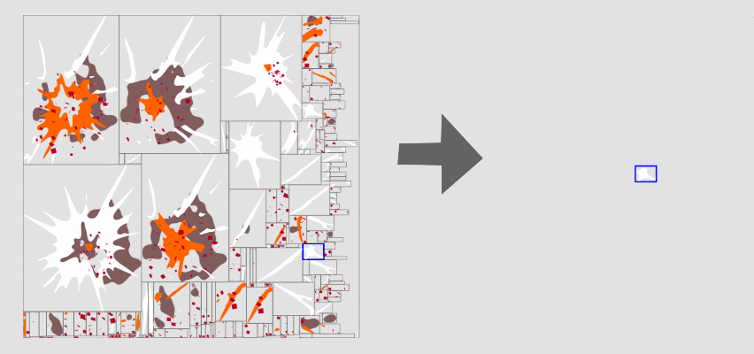

# Textures

We discussed previously how to position images on the screen, but in this
section we will discuss the types of images (textures) we can draw.

Our game engine supports different texture formats.  There are also special
processes to convert the assets from our artists into our engine's supported
formats.  So, this section will go into detail about these formats and
processes.

## Metadata

Every image that we wish to put in our engine must have an associated metadata
file so that the engine knows how to interpret it.  If we have an image named
"logo.png", the engine expects a file named "logo.png.json" that will describe
its type and any additional information required to parse it.

## Bitmaps vs Vectors

There are two types of texture formats: bitmaps and vectors.  Let's look at
their differences.

### Composure

Bitmaps are the conventional textures that are composed of pixels (e.g. PNG,
JPG).  Vector textures are composed of shapes (e.g. SVG).

### Scaling

The most noticeable benefit of vector textures is that they inherently retain
their quality across different scales.  This helped us to keep the pterodactyls
looking smooth as they came flying toward the screen.

### Overdraw

Drawing pixels is expensive. As a rule of thumb, you want to reduce the
amount of pixels you draw, even transparent ones!

Our backgrounds environments were composed of multiple large layers.  Drawing
them as fullscreen bitmaps would create so much over-draw due to the large
amount of transparent space being drawn.  Drawing them as vectors would
minimize the amount of space being drawn.

### Memory

Using vectors also saves us texture memory since we are just storing vertices
and fill colors for the shapes.  Even though PNG and JPG bitmaps are very well
compressed, they are decompressed when stored in video memory.

## Bitmap Workflow

For the most part, the bitmaps used in the game are stored separately from one
another, as distinct PNG images.  The bitmap texture dimensions in memory
must always be a power of 2, so the textures are sized in such a way to minimize
any wasted space when they are stored in memory.

### Packing

There are benefits to packing multiple textures into a single texture.
Sometimes it helps with asset management to logically group related textures by
combining them, especially frames of an animation.  It may also help with
texture memory if you can pack a lot of small textures you want to pack
together.  

But perhaps most important is the fact that texture binding is expensive.  To
draw a texture, you must first bind it.  So if you are drawing multiple
textures, you will increase performance if you only have to do a single bind to
draw them all.

The google-able word to describe these types of textures is "texture atlas".
But I use very specific types of texture atlases which I call "tables" and
"mosaics" described in the next section.

### Tables

Tables were used in the first iteration of our texture packing tools.  A table
has a number of rows and columns.  It consists of uniformly-sized cells to
house separate textures.

The example below is a texture containing a table of smaller textures.  Notice that each cell
is the same size.

### Mosaics

Mosaics were the second iteration of our texture packing tools that we used to
aggressively decrease the footprint of certain animated bitmaps.  This was a
solution we used for the explosion that you can see below.  We also used it for
the small animated sections of our backgrounds, which were made obsolete when
we shifted to vector backgrounds.

We created a tool for authoring these "mosaics".  The tool accepts a series of
images as input.  It then isolates contiguous regions of each image, performs a
smart-merging strategy of the contiguous regions, then packs all the regions of
all the images into a single image.  It also creates a metadata file noting the
locations of each region and their original locations in their source images.
This was useful for minimizing overdraw of bitmap animations as you can see
above.

[The Mosaic tool is available here on GitHub.](https://github.com/shaunew/HygoonMosaic)

### Fonts

We initially used TrueType fonts in our game, but profiling our game revealed
that they are very slow to draw.  So we purchased [Glyph
Designer](http://71squared.com/en/glyphdesigner) to help create customized
bitmap fonts for use in our game.  We were able to create a script to convert
their metadata file to a "mosaic" metadata file for use in our engine.

## Vector Workflow

Getting vectors into the game was a bit of an epic crisis.  I was getting assets
from our artists in different formats that needed to be displayed in the engine somehow.

So I created a workflow of tools to take SWF and SVG files and convert them into
the different formats we needed for each browser and CocoonJS.

In Firefox, we use Canvas Path calls to draw vectors.  In CocoonJS, we use a
mixture of Canvas Path objects and calls.  In webkit browsers, we use SVG.

### SWF

The pterodactyl animations were done in flash format SWF.  I was able to
convert each frame of the animation into a separate SVG.

### SVG

SVG images can be drawn onto an HTML5 canvas in browsers, particularly well on
Webkit browsers.  But the Firefox browser chokes on large SVG images.  CocoonJS
does not support SVG images.

### Canvas Paths

We convert SVG images into Canvas Paths (i.e. Canvas path function calls for
building paths).  The HTML Canvas spec includes Path objects for caching path
definitions so they can be drawn multiple times without calling the string of
functions to rebuild it.  CocoonJS supports a subset of this spec, whereas
browsers have been slow to implement it.  Safari 7 is the first browser to support
it, and it came out 43 days ago at the time of this writing.

